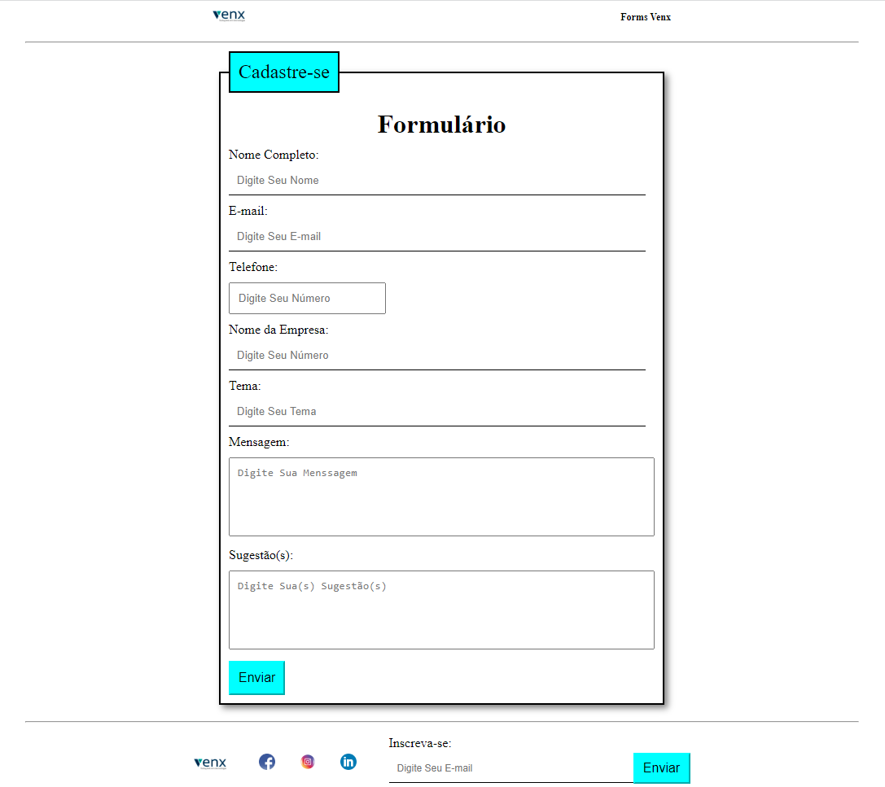
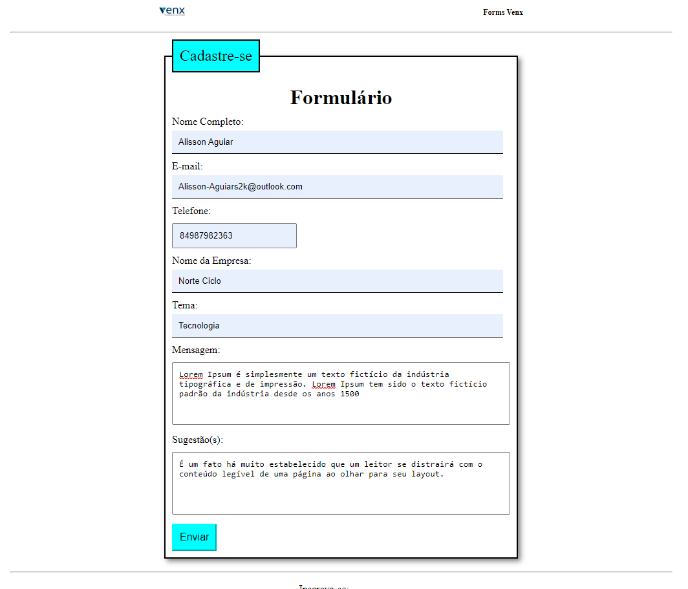
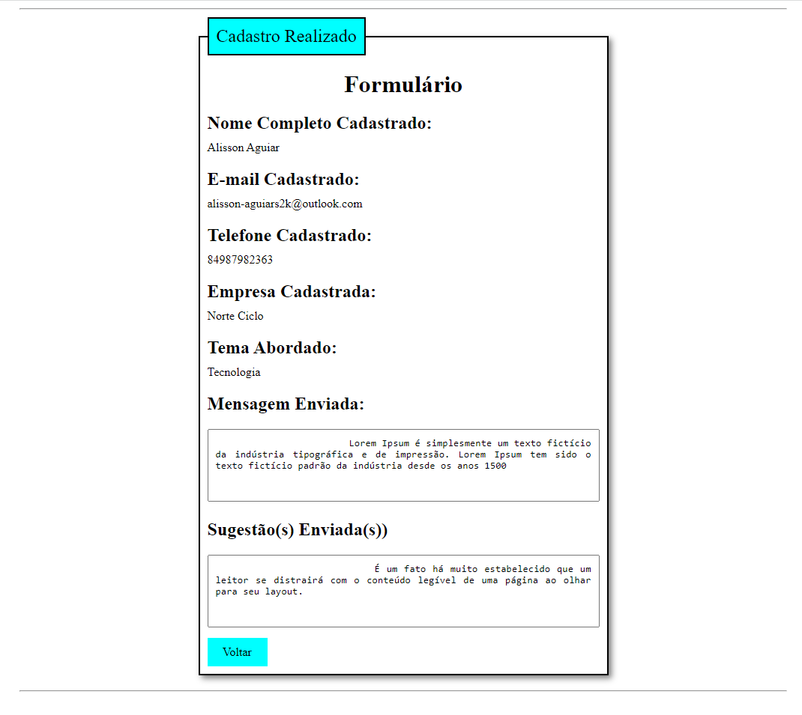
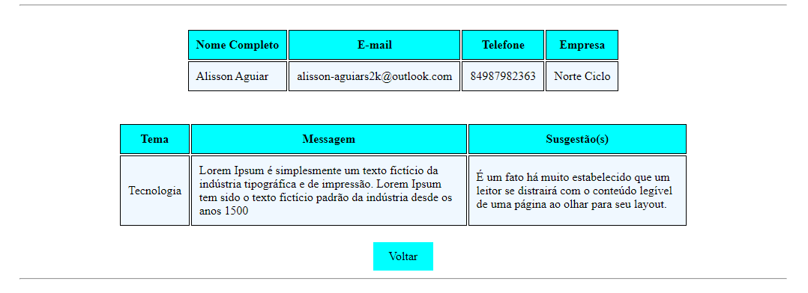

# Form in PHP.

## Description Project:
- Form developed in php, displaying the required fields and in another file in table format.

### Programming and Markup Language;

 
  

### Styling Language;

    

### Form

### Form Filled

### Form Result 

### Form Result Table
